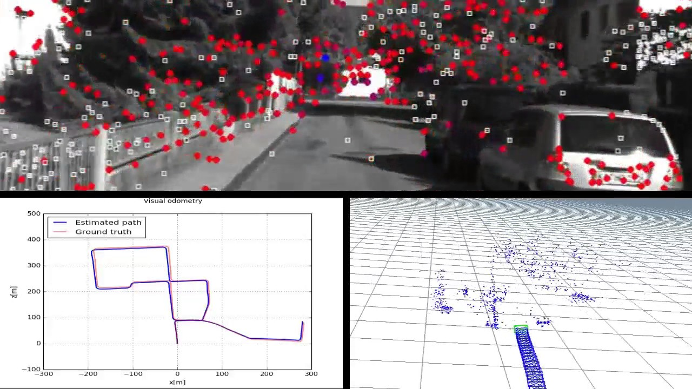
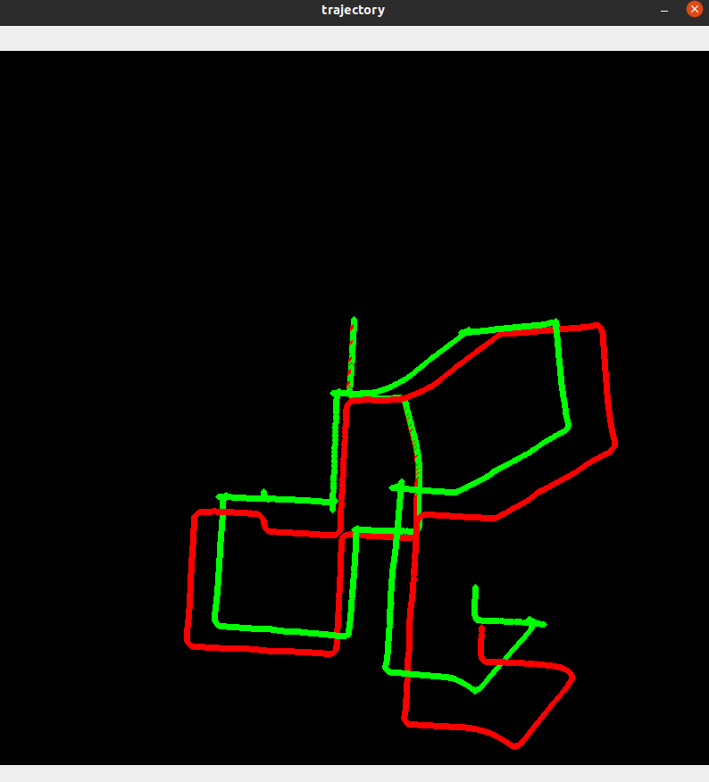
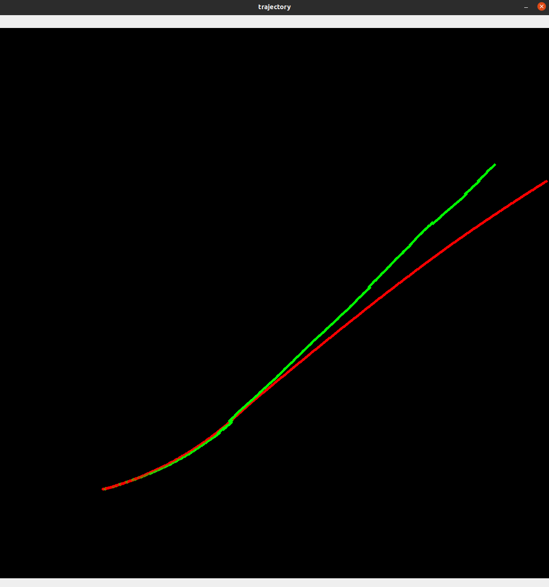

# Monocular_VO

Here is the project website: https://alexlin2.github.io/Monocular_VO/

## Abstract

Determining the trajectory or direction of travel of a mobile robot or car is essential for navigation and and movement. If you have ever driven a car then you would notice a number on your dashboard that tells you how far your car has travel in it's lifespan. This is called an odometer. This information is essential for mechanics to diagnose the health and deterioration of your vehicle and it determines your car's used value on the second hand market. Odometry is also vital for robot navigation, this information is used to determine the state of the robot at any given time. However, odometry is often hard to do without supporting hardware, and inaccurate when using a traditional wheel speed sensor. This project aims to do simple odometry using just a single rgb camera. It solves a complex problem using just software and knowledge of computer vision. 

# Presentation Video

# Problem statement

Odometry in essense is determining the distance traveled and the direction of travel of the camera at any given time. So for every time instance $t$, we want to determine the pose vector  that describes the position and orientation of the camera. Note that  is in Euler angles, and  is in Cartesian coordinates. For this problem, we are given the initial known position, and the initial orientation of the camera. They are given as a 3 by 3 rotation matrix  and a 3 by 1 translation vector . Camera instrinsic such as focal length and the principle point will also be known, and we are assuming a pinhole camera model. 

# Algorithm

I used Nister's Five Point Algorithm for Essential Matrix estimation. The essential matrix is a 3x3 matrix that relates corresponding points in two images, it is similar to the homography matrix that we learned in class. I also used the FAST(Features from accelerated segment test) algorithm to detect corners and features in the image, it is similar to the ORB features that we learned in class. 

Here is an outline of the algorithm:

1. Capture two consecutive images at  and  + 1
2. Use `cv2.FastFeatureDetector` to detect keypoints in the first image at time 
3. Use LK optical flow `cv2.calcOpticalFlowPyrLK` to determine the corresponding keypoints in the second image at time +1 
4. Use Nister's Five Point Algorithm `cv2.findEssentialMat` with RANSAC to find the essential matrix that describe the corresponding point from image  to image +1 
5. Estimate the rotation matrix  and the translation vector  from the essential matrix that was obtained in the last step.
6. Use the formula  and  +  to determine the new pose vector that describes the position and orientation of the camera

# Dataset

The dataset used is [KITTI Visual Odometry](http://www.cvlibs.net/datasets/kitti/eval_odometry.php). The dataset provides 10 labeled and 10 unlabeled sequences of urban driving video both in RGB and grayscale. The annotation for each frame includes a 3x4 matrix that contains both the rotation and translation vectors. It also includes calibration files for the camera. All images in the dataset are undistorted.

# Previous work

Most of the algorithm and technique that I used for the project was inspired by Avi Singh's blog post on Monocular Visual Odometry: http://avisingh599.github.io/vision/monocular-vo/. He also had a c++ implementation found [here](https://github.com/avisingh599/mono-vo). 

I wrote all of the code, a lot of it was referenced from OpenCV's official API documentation and tutorial. 

The OpenCV docs and tutorials I used were:

[Optical Flow](https://docs.opencv.org/3.4/d4/dee/tutorial_optical_flow.html)

[Fast Feature Detection](https://docs.opencv.org/3.4/df/d0c/tutorial_py_fast.html)

[Epipolar Geometry](https://docs.opencv.org/3.4/da/de9/tutorial_py_epipolar_geometry.html)

# Results

After running the algorithm in urban environment and on highways, there are a few weak sides to the algorithm. Obviously Monocular Odometry is not going to be super accurate because images are planar and it's hard to estimate 3D information from 2D images. Also, the keypoints detected using FAST features are often not that reliable and disappear in consecutive frames. This messes up the RANSAC algorithm and leads to inaccurate essential matrix estimations. 

The metric that I used to determine how good the algorithm was is Mean Squared Error. For trajectories, the MSE represents the average distance that the predicted trajectory is off from the ground truth trajectory.

The **average MSE** I got for urban driving scene was: 51.145

The **average MSE** I got for highway scene was: 30.564

From the results, it seems that Monocular VO works better on highways because it seems like the algorithm tends to fail when the car is taking sharp corners. 

Below are trajectories generated from the algorithm described above, the red path is the ground truth, the green path is the predicted trajectory from the camera using the algorithm. 

This is the trajectory taken from a video of a car driving in an urban environment.

This is the trajectory taken from a video of a car driving on a highway.

# References

1. OpenCV official docs: https://docs.opencv.org/4.x/

2. Avi Singh's blog post on Monocular Visual Odometry https://avisingh599.github.io/vision/monocular-vo/
